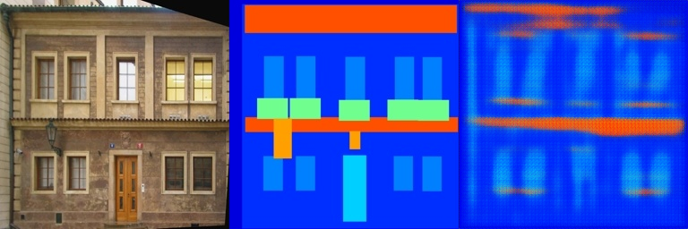
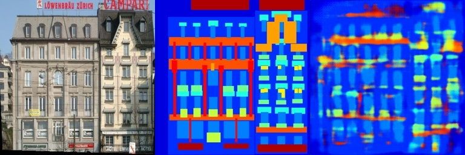
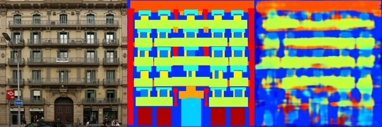
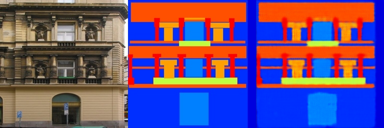
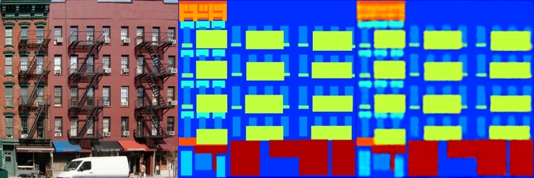

# 数字图像处理第二次作业报告

## 基于 PyTorch 的 Poisson 图像融合与全卷积图像转换

> 姓名：_冯浩_
> 学号：SC24005008
> 
## 1. 实验目的

本次作业包含两个相互联系、但实现思路不同的图像处理任务。第一部分完成 Poisson Image Editing：在前景图像中手动选取一个多边形区域，将其移动到背景图像中的指定位置，并通过梯度域优化减弱直接粘贴产生的边界突变。第二部分搭建全卷积编码器—解码器，以建筑立面照片为输入，预测对应的语义标注图。

这两部分分别代表了传统优化方法和数据驱动方法。Poisson 融合不需要数据集，直接把待输出图像的像素作为优化变量；全卷积网络则通过成对样本学习从 RGB 图像到语义图的映射。完成实验的重点不仅是把模板中的空缺补齐，也包括理解掩膜、离散拉普拉斯算子、卷积下采样和转置卷积上采样在整个流程中的作用。

## 2. 实验环境与代码结构

实验程序使用 Python 编写，主要依赖如下：

- PyTorch：张量计算、卷积运算、自动求导和模型构建；
- NumPy：图像数组与坐标数据处理；
- Pillow：多边形绘制及二值掩膜生成；
- Gradio：Poisson 融合程序的交互界面；
- OpenCV：训练模板中的图像读取与结果保存。

Poisson 融合程序在运行时自动检查 CUDA 是否可用，若检测到 GPU 则使用 `cuda:0`，否则使用 CPU。由于该部分需要对整幅输出图像进行 5000 次迭代，使用 GPU 时交互等待时间会明显缩短。

本次提交中与任务二直接相关的文件为：

```text
Assignment_02/
├── 第二次作业.01.py      # Poisson 图像融合及 Gradio 界面
├── 第二次作业.02.py      # 全卷积编码器—解码器
└── pics/
    ├── result_1.png
    ├── result_2.png
    ├── result_3.png
    ├── result_4.png
    └── result_5.png
```

## 3. Poisson 图像融合

### 3.1 方法原理

若直接把前景区域复制到背景图中，即使两幅图在内容上可以组合，接缝处仍常常会出现明显的颜色或亮度跳变。Poisson 图像融合不直接要求目标区域的像素值与前景完全相同，而是尽量保留前景区域内部的梯度，同时让区域边界受背景约束。其连续形式可以写为

$$
\min_f \int_{\Omega}\left\lVert \nabla f-\nabla g\right\rVert^2\,\mathrm d\mathbf{x},
\qquad f|_{\partial\Omega}=f_{\mathrm{bg}}|_{\partial\Omega},
$$

其中，$g$ 表示前景图像，$f$ 表示待求的融合图像，$\Omega$ 是用户选中的区域，$\partial\Omega$ 是区域边界。直观地说，区域内部尽可能沿用前景的纹理和边缘，边界则逐渐服从背景图像，因此结果通常比直接粘贴自然。

在离散图像上，本实验使用四邻域拉普拉斯算子：

$$
\Delta I(x,y)=I(x-1,y)+I(x+1,y)+I(x,y-1)+I(x,y+1)-4I(x,y),
$$

对应的 $3\times3$ 卷积核为

$$
K=
\begin{bmatrix}
0&1&0\\
1&-4&1\\
0&1&0
\end{bmatrix}.
$$

对前景图像和当前融合结果分别施加该卷积核，再计算二者在选区内的差异，就可以利用 PyTorch 自动求导逐步更新融合结果。

### 3.2 多边形掩膜生成

程序允许用户在前景图中依次点击顶点。至少选取三个点后闭合多边形，再把顶点集合转换为二值掩膜。实现时先建立全零的 `uint8` 数组，再借助 Pillow 填充多边形内部：

```python
def create_mask_from_points(points, img_h, img_w):
    mask = np.zeros((img_h, img_w), dtype=np.uint8)
    img = Image.fromarray(mask)
    draw = ImageDraw.Draw(img)

    if len(points) > 2:
        draw.polygon(points.flatten().tolist(), fill=255)

    return np.array(img)
```

掩膜外部保持为 0，内部填充为 255。后续转换成张量并除以 255 后，掩膜就变为只包含 0 和 1 的浮点张量。用户调整水平偏移量 `dx` 和垂直偏移量 `dy` 时，程序对多边形顶点做同样的平移，由此分别得到源区域掩膜和目标位置掩膜。

### 3.3 拉普拉斯损失

输入图像包含 RGB 三个通道。为了让同一个拉普拉斯核分别作用于三个通道，我将卷积核复制三份，并在 `conv2d` 中设置 `groups=3`：

```python
laplacian_kernel = torch.tensor(
    [[0, 1, 0],
     [1, -4, 1],
     [0, 1, 0]],
    dtype=torch.float32,
    device=foreground_img.device
).unsqueeze(0).unsqueeze(0)

laplacian_kernel = laplacian_kernel.repeat(3, 1, 1, 1)

fg_lap = torch.nn.functional.conv2d(
    foreground_img, laplacian_kernel, padding=1, groups=3
)
blend_lap = torch.nn.functional.conv2d(
    blended_img, laplacian_kernel, padding=1, groups=3
)
```

`padding=1` 使卷积前后空间尺寸保持不变。随后利用前景和背景位置的掩膜限制损失范围，并以均方差衡量拉普拉斯响应之间的距离：

$$
\mathcal L_{\mathrm{lap}}
=\frac{1}{3HW}\sum_{c=1}^{3}\sum_{x=1}^{W}\sum_{y=1}^{H}
\big(M_f\odot\Delta I_f-M_b\odot\Delta I_b\big)_{c,y,x}^{2}.
$$

这里 $M_f$ 和 $M_b$ 分别表示源区域与目标区域掩膜。在代码中还取两幅拉普拉斯响应的公共高、宽范围，使前景图和背景图尺寸不完全相同时仍能进入损失计算。

### 3.4 图像优化过程

该部分没有训练神经网络，真正被优化的是输出图像 `blended_img`。初始化时先复制背景，仅在目标掩膜内加入少量前景信息：

```python
blended_img = bg_img_tensor.clone()
blended_img[mask_expanded] = (
    blended_img[mask_expanded] * 0.9
    + fg_img_tensor[fg_mask_tensor.bool().expand(-1, 3, -1, -1)] * 0.1
)
blended_img.requires_grad = True
```

随后使用 Adam 优化器，初始学习率设为 $10^{-2}$，共迭代 5000 次。每次迭代都先构造仅允许掩膜内部传播梯度的图像：

```python
blended_img_for_loss = (
    blended_img.detach() * (1.0 - bg_mask_tensor)
    + blended_img * bg_mask_tensor
)
```

掩膜外使用 `detach()` 后的张量，因此该区域不会被梯度更新；掩膜内仍保留计算图。迭代进行到总步数的三分之二时，将学习率缩小为原来的十分之一，使前期能够较快靠近合理解，后期则进行更稳定的细化。最后将结果限制在 $[0,1]$，再恢复为 `uint8` 图像。

### 3.5 交互流程

Gradio 界面的实际操作顺序如下：

1. 上传前景图像并依次点击多边形顶点；
2. 点击 **Close Polygon** 闭合选区；
3. 上传背景图像；
4. 使用 `dx`、`dy` 滑块调整选区在背景中的位置；
5. 点击 **Blend Images** 开始优化并输出融合图像。

与在程序中写死矩形选区相比，交互式多边形可以更贴近物体轮廓；目标位置也可以在运行时直接观察和调整，便于比较不同边界背景对融合效果的影响。

### 3.6 存在的问题与改进方向

当前程序已经能完成从选区到优化输出的完整流程，但仍有两个值得进一步处理的边界情况。第一，若平移后的多边形越过背景边界，源掩膜和目标掩膜中的有效像素数可能不再一致；更稳妥的做法是在移动前限制 `dx`、`dy`，或对越界区域同步裁剪。第二，当前损失是在整幅公共尺寸图像上分别乘两个位置不同的掩膜。当偏移较大时，源位置和目标位置并没有逐像素对齐。后续可以先取出多边形的局部包围盒，将源区域裁剪后平移到目标坐标系，再比较对应位置的拉普拉斯响应。这样会更贴近 Poisson 方程中“同一局部坐标”的含义。

## 4. 基于全卷积网络的图像转换

### 4.1 数据形式与任务定义

Facades 数据中的样本由两张 $256\times256$ 图像左右拼接而成：左侧为建筑立面照片，右侧为对应的彩色语义标注。数据加载时将像素从 $[0,255]$ 映射到 $[-1,1]$：

$$
x_{\mathrm{norm}}=2\frac{x}{255}-1.
$$

网络学习的映射可以写为

$$
G:\mathbb R^{3\times256\times256}
\rightarrow\mathbb R^{3\times256\times256},
$$

即输入一幅 RGB 建筑照片，输出同尺寸、三通道的语义颜色图。本实验按照模板要求完成全卷积网络部分。训练脚本使用 L1 损失进行监督学习，因此它更准确地说是 Pix2Pix 数据形式下的 FCN 基线，而不是包含生成器、判别器和对抗损失的完整条件 GAN。

### 4.2 网络结构

我采用对称的编码器—解码器结构。编码端连续四次使用步长为 2 的卷积，将空间尺寸由 $256\times256$ 压缩到 $16\times16$，同时将通道数从 3 增加到 512。解码端使用四层转置卷积逐步恢复空间分辨率，最后输出三通道预测图。

| 阶段 | 运算 | 输出尺寸 |
|---|---|---:|
| 输入 | — | $3\times256\times256$ |
| Conv1 | $4\times4$, stride 2, 3→64 | $64\times128\times128$ |
| Conv2 | $4\times4$, stride 2, 64→128 | $128\times64\times64$ |
| Conv3 | $4\times4$, stride 2, 128→256 | $256\times32\times32$ |
| Conv4 | $4\times4$, stride 2, 256→512 | $512\times16\times16$ |
| Deconv1 | $4\times4$, stride 2, 512→256 | $256\times32\times32$ |
| Deconv2 | $4\times4$, stride 2, 256→128 | $128\times64\times64$ |
| Deconv3 | $4\times4$, stride 2, 128→64 | $64\times128\times128$ |
| Deconv4 | $4\times4$, stride 2, 64→3 | $3\times256\times256$ |

除最后一层外，每层都由卷积或转置卷积、Batch Normalization 和 ReLU 组成。最后使用 `Tanh`：

```python
self.deconv4 = nn.Sequential(
    nn.ConvTranspose2d(64, 3, kernel_size=4, stride=2, padding=1),
    nn.Tanh()
)
```

这样输出范围与数据预处理得到的 $[-1,1]$ 保持一致。整个网络不包含全连接层，因此能够保留二维空间结构，并输出与输入一一对应的像素预测。

### 4.3 损失函数

训练模板采用 L1 损失：

$$
\mathcal L_{L1}=\frac{1}{N}\sum_{i=1}^{N}\lvert \hat{y}_i-y_i \rvert.
$$

与均方误差相比，L1 对少量较大误差不那么敏感，在图像重建任务中通常能减少过度平滑。不过，当同一区域存在多种可能标签、网络容量有限或样本结构较复杂时，仅使用逐像素损失仍会倾向于输出相邻类别颜色的折中结果。从本次实验图中可以明显观察到这种现象。

## 5. 实验结果与分析

下列结果均按“输入建筑照片—真实语义标注—网络预测”的顺序横向排列。

### 5.1 结果一：单体建筑立面



第一组建筑结构相对简单。网络正确恢复了大面积蓝色墙面、屋顶的横向区域以及底层的主要分界，也能在大致位置给出窗户和门。问题主要出现在细节处：上方屋顶预测向下扩散，窗户由目标图中的离散矩形变成较宽的模糊响应，门和横梁的边界也不够锐利。这说明编码器已经获得全局布局，但下采样过程中丢失的局部位置还没有被完整恢复。

### 5.2 结果二：相邻建筑与密集窗格



第二组包含相邻建筑、不同屋顶以及大量密集窗格，是五组样本中结构较复杂的一组。预测图能够区分左右两栋建筑的大体轮廓，也保留了多层横向排列关系；但是窗框、阳台和细长竖直结构出现明显混色，右上角还产生较亮的局部响应。其原因一方面是连续四次下采样降低了细节分辨率，另一方面是普通编码器—解码器没有跨层连接，解码器只能依据 $16\times16$ 的高层特征重建细节。

### 5.3 结果三：重复楼层结构



第三组的楼层和阳台具有很强的重复性。预测结果较好地恢复了多条水平带状结构，说明网络确实学到了建筑立面常见的层次规律；但黄色区域在水平方向相互粘连，窗户之间的蓝色间隔被压缩，底层入口附近也出现了类别混合。换句话说，模型更擅长判断“这一高度大概是什么构件”，但对每个独立构件的精确边界判断不足。

### 5.4 结果四：规则、低复杂度立面



第四组是整体效果最好的一组。目标语义图中的屋顶、两层横梁、立柱和底层大块区域在预测中都被较完整地保留下来，主要颜色类别也没有明显混淆。仍然可以看到边缘轻微变软，底部浅蓝矩形的对比度有所降低，但整体拓扑结构与真实标注较为一致。这说明当前网络对规则、尺度较大的构件具有较稳定的表达能力。

### 5.5 结果五：大面积规则窗区



第五组同样具有比较规则的网格结构。网络较准确地恢复了三列主要窗区、底层红色区域以及顶部左侧结构，输出的类别颜色也比第二、三组更集中。细小竖条和窗间隔仍有一定模糊，但没有破坏整体布局。该结果进一步说明：当目标区域尺寸较大、排列规律明显时，L1 监督下的 FCN 可以给出较可靠的预测；困难主要集中在窄边界、小构件和复杂相邻关系上。

### 5.6 综合讨论

五组实验中，网络对建筑的整体轮廓、楼层数量和大面积语义区域表现较好，说明编码器提取到的高层结构信息是有效的。第 4、5 组由于几何结构规整，预测与标签的一致性最高；第 2、3 组包含密集窗格、阳台和细长构件，预测结果出现较明显的模糊和类别渗透。这种差异与网络结构是对应的：连续下采样扩大了感受野，却也损失了像素级位置信息，而当前解码器没有直接利用浅层特征。

如果继续改进，可以在编码器和解码器对应尺度之间加入 skip connection，构成 U-Net。例如将 `conv3` 的输出与第一层解码特征拼接，再送入下一层转置卷积。浅层特征中的边缘和坐标信息可以绕过最深瓶颈，有助于恢复窗框等细节。此外，还可以加入 PatchGAN 判别器与条件对抗损失，使输出在局部纹理和边缘锐度上更接近真实语义图；不过这将从当前 FCN 基线扩展为完整的 Pix2Pix 框架。

## 6. 实验总结

本次作业完成了传统梯度域融合和深度学习图像转换两个任务。在 Poisson 融合部分，我将用户点击的多边形转换为二值掩膜，使用分组卷积计算 RGB 三通道的拉普拉斯响应，并通过 Adam 直接优化融合图像像素。这个过程让我更直观地理解了“保持前景梯度、服从背景边界”与直接复制像素之间的区别。

在全卷积网络部分，我完成了四层编码、四层解码的对称结构，并使用 `Tanh` 保证网络输出和归一化标签处于相同数值范围。从结果来看，模型已经能够预测建筑语义图的总体布局，但对密集的小尺度构件仍不够准确。实验中最明显的体会是：网络能否恢复细节不仅取决于训练轮数，也和特征在下采样、上采样过程中的传递方式直接相关。后续若加入 U-Net 跳跃连接，并进一步使用对抗损失，预测边界仍有较大的提升空间。

## 参考资料

1. P. Pérez, M. Gangnet, A. Blake, “Poisson Image Editing,” *ACM Transactions on Graphics*, 2003.
2. P. Isola, J.-Y. Zhu, T. Zhou, A. A. Efros, “Image-to-Image Translation with Conditional Adversarial Networks,” *CVPR*, 2017.
3. J. Long, E. Shelhamer, T. Darrell, “Fully Convolutional Networks for Semantic Segmentation,” *CVPR*, 2015.
4. PyTorch Documentation, `torch.nn.functional.conv2d` and `torch.nn.ConvTranspose2d`.
