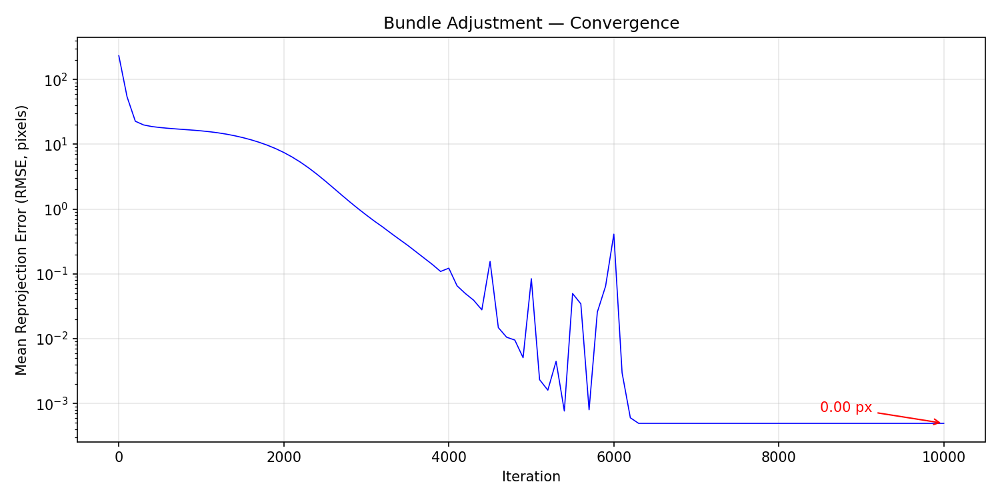
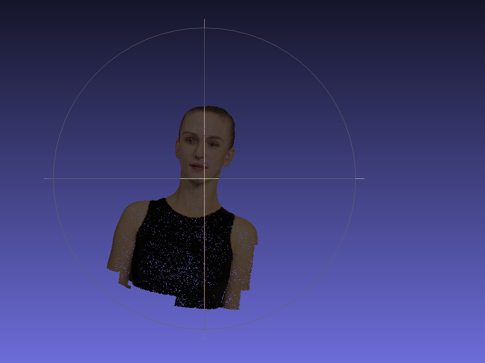
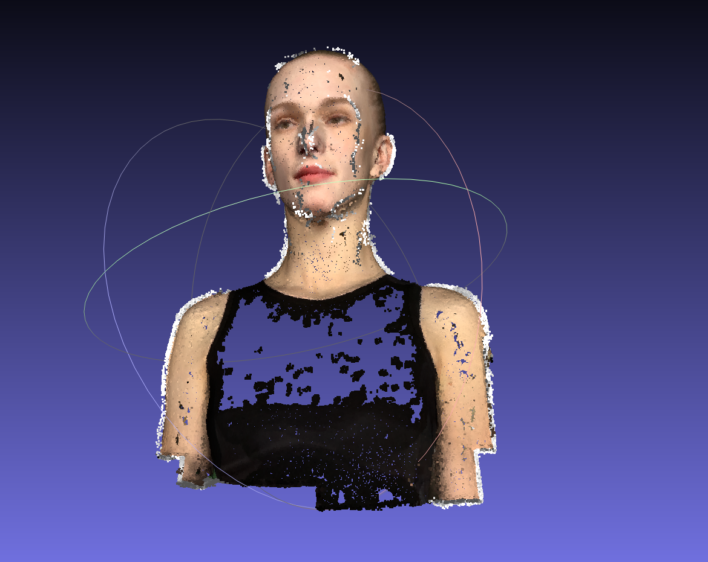

# Assignment 3：Bundle Adjustment 与多视图三维重建

> 姓名：___冯浩___
> 学号：SC24005008

## 1. 实验目的

本次作业包含两个相互关联的部分。第一部分不借助现成的重建框架，使用 PyTorch 从二维观测中联合估计三维点、相机外参以及共享焦距，以此理解 Bundle Adjustment（BA）的目标函数和求解过程；第二部分使用 COLMAP 对同一组多视角图像完成从特征匹配到稠密点云融合的完整流程，并对两种方法得到的结果进行比较。

数据集中共有 50 个视角，每张图像的分辨率为 $1024\times1024$。场景包含 20,000 个带颜色的三维采样点，`points2d.npz` 给出了每个点在不同视角下的二维坐标和可见性标记。BA 部分直接利用这些已经建立好对应关系的二维观测；COLMAP 部分只使用渲染图像，自行完成特征检测、匹配和几何重建。

## 2. Bundle Adjustment 原理

设第 $j$ 个三维点为 $P_j=[X_j,Y_j,Z_j]^T$，第 $i$ 个相机的旋转和平移分别为 $R_i$ 和 $T_i$。世界坐标到相机坐标的变换为

$$
P_{ij}^{c}=R_iP_j+T_i=[X_{ij}^{c},Y_{ij}^{c},Z_{ij}^{c}]^T.
$$

本实验采用的相机坐标约定与常见的 $Z_c>0$ 模型略有不同：物体在相机坐标系中位于负 $Z$ 方向。主点固定在图像中心 $(c_x,c_y)=(512,512)$，投影公式为

$$
u_{ij}=-f\frac{X_{ij}^{c}}{Z_{ij}^{c}}+c_x,\qquad
v_{ij}= f\frac{Y_{ij}^{c}}{Z_{ij}^{c}}+c_y.
$$

其中水平方向的负号用于保证投影结果不会左右翻转。程序开始优化前用原点 $P=[0,0,0]^T$、单位旋转以及 $T=[0,0,-2.5]^T$ 做了单元检查，投影结果为 $(512,512)$，与预期一致。

若 $p_{ij}$ 表示实际二维观测，$m_{ij}$ 表示可见性，则优化目标为所有有效观测上的平均重投影误差：

$$
E=\frac{1}{\sum_{i,j}m_{ij}}
\sum_{i,j}m_{ij}\left\|\pi(R_i,T_i,P_j,f)-p_{ij}\right\|_2^2.
$$

报告中的 RMSE 由 $\sqrt{E}$ 得到，单位为像素。不可见点没有参与误差计算，避免将遮挡点的无效坐标错误地当成监督信号。

## 3. PyTorch 实现

### 3.1 数据组织

每个视角的数据形状为 $(20000,3)$，三列依次为横坐标、纵坐标和可见性。为了减少每轮优化中的 Python 循环，我在优化前先提取每个视角的可见点索引，将不同长度的观测补齐到该批次中的最大长度，同时保存一个布尔掩码。这样，50 个视角可以在一次批量矩阵运算中完成投影。补齐位置虽然也会进行索引和投影，但最终会被掩码排除，不影响损失。

这种实现方式的主要好处不是改变 BA 的数学形式，而是减少 GPU 上大量细碎的 kernel 调用。批量张量的主要形状如下：

| 数据 | 形状 | 含义 |
|---|---:|---|
| `points_3d` | $(20000,3)$ | 待优化三维点 |
| `euler_angles` | $(50,3)$ | 每台相机的 Euler 角 |
| `T` | $(50,3)$ | 每台相机的平移 |
| `all_point_idx` | $(50,M)$ | 补齐后的可见点索引 |
| `all_obs_xy` | $(50,M,2)$ | 二维观测 |
| `valid_mask` | $(50,M)$ | 有效观测掩码 |

其中 $M$ 是单个视角可见点数量的最大值。

### 3.2 参数化与初始化

旋转使用三个 Euler 角表示，并通过 PyTorch3D 的 `euler_angles_to_matrix(..., convention="XYZ")` 转换成合法旋转矩阵。相比直接优化 $3\times3$ 矩阵，该方法不会破坏旋转矩阵的正交约束。

初始参数设置如下：

- 50 组 Euler 角全部置零，即从单位旋转开始；
- 相机平移初始化为 $[0,0,-2.5]^T$；
- 三维点由标准差为 0.1 的高斯分布在原点附近随机生成，随机种子固定为 42；
- 初始视场角取 $60^\circ$，由
  $$f=\frac{H}{2\tan(\mathrm{FoV}/2)}$$
  得到初始焦距约为 886.81 像素；
- 主点固定为 $(512,512)$，不考虑镜头畸变。

投影时使用 $|f|$ 保证焦距为正，并在深度分母上加入带符号的极小量，避免数值上除以零。该处理主要用于提高训练初期的稳定性。

### 3.3 优化设置

优化器采用 Adam，不同参数使用不同学习率：

| 参数 | 初始学习率 |
|---|---:|
| 焦距 $f$ | $1\times10^{-3}$ |
| Euler 角 | $5\times10^{-4}$ |
| 相机平移 $T$ | $5\times10^{-3}$ |
| 三维点坐标 | $5\times10^{-3}$ |

旋转的学习率低于点坐标和平移，是为了减弱相机姿态剧烈变化对全部投影点造成的影响。学习率调度采用 `ReduceLROnPlateau`：当误差连续 300 轮没有改善时，所有参数组的学习率减半，最低学习率设为 $10^{-7}$。GPU 环境下最多执行 10,000 次迭代，每 100 次记录一次 RMSE。

优化的核心步骤可以概括为：根据可见点索引收集三维点，将 Euler 角转换为旋转矩阵，批量计算相机坐标和二维投影，再对有效观测计算掩码均方误差，最后由自动微分同时更新焦距、相机外参和三维点。

## 4. BA 实验结果

### 4.1 收敛情况

从曲线可以看出，初始重投影误差在数百像素量级，前几百次迭代快速下降至约 20 像素；随后进入相对平缓的联合调整阶段，在约 2000 至 4000 次迭代之间继续下降两个数量级。4000 至 6100 次附近出现了几次短暂波动，这是相机姿态、点坐标和焦距耦合优化时产生的震荡；在 Adam 和学习率调度的作用下，误差都能重新回落。约 6300 次以后曲线基本稳定，最终 RMSE 约为 $5\times10^{-4}$ 像素。

曲线末端显示的“0.00 px”来自保留两位小数后的格式化结果，并不表示误差在数值上严格等于零。如此小的训练误差是合理的，因为二维观测由同一批三维点的理想投影生成，点的跨视角编号已经给定，且模型中没有加入畸变或观测噪声。换言之，本部分更侧重验证 BA 的参数恢复能力，而不是处理真实图像中不可避免的错误匹配和噪声。

### 4.2 三维点云

最终将优化后的 20,000 个三维点保存为带顶点颜色的 OBJ 文件，每行格式为 `v x y z r g b`。从可视化结果看，人物的头部轮廓、五官、颈部、肩膀以及衣服区域都能被正确辨认，左右关系和整体朝向也没有发生翻转。这说明相机坐标约定、可见性掩码及联合优化均起到了预期作用。

点云在衣服黑色区域显得更稀疏，这一方面与原始表面采样和遮挡有关，另一方面也与显示背景及顶点颜色较暗有关。该结果由固定的 20,000 个表面点构成，因此它呈现的是带颜色的稀疏表面采样，而不是连续网格。BA 本身只保证重投影一致性，并不会额外生成新的点或建立三角面片。

需要说明的是，单纯依靠重投影误差得到的重建存在整体旋转、平移和尺度上的自由度。因此，评价结果时应重点观察形状和投影是否正确，而不能要求其绝对坐标与某个外部坐标系完全一致。此外，程序会在运行结束时打印最终焦距和对应视场角，但本次输出文件没有单独保存这两个标量，因此报告不额外填写无法由现有结果复核的数值。

## 5. COLMAP 多视图重建

### 5.1 重建流程

第二部分仅以 `data/images/` 下的 50 张图像作为输入。脚本依次执行以下步骤：

1. 使用 `feature_extractor` 提取局部特征；
2. 使用 `exhaustive_matcher` 对图像进行穷举匹配；
3. 使用 `mapper` 完成增量式稀疏重建，其中包含三角化和 BA；
4. 使用 `image_undistorter` 为稠密重建准备图像和相机参数；
5. 使用 `patch_match_stereo` 估计多视图深度与法向；
6. 使用 `stereo_fusion` 融合深度图，输出 `fused.ply`。

由于全部图像来自同一台虚拟相机，特征提取阶段使用 `PINHOLE` 模型，并设置 `ImageReader.single_camera=1`，让各视角共享同一组内参。这一设置既符合数据生成方式，也减少了独立估计 50 组内参带来的不稳定性。

### 5.2 稠密重建结果

融合后的 PLY 文件包含 109,757 个带颜色和法向的顶点。与手写 BA 得到的 20,000 点相比，COLMAP 稠密结果在面部、头部和肩部形成了更连续的表面，五官及衣服边缘也更加清楚。图中围绕人物的曲线是查看软件显示的相机轨迹或视图辅助线，不属于重建几何。

结果中仍能观察到若干典型问题：人物轮廓附近有少量漂浮点，头顶和肩部边缘存在白色噪声，黑色衣服中间出现较明显的孔洞。其原因主要有三点。第一，纯黑或纹理较弱的区域难以获得稳定的局部特征和像素对应；第二，轮廓位置在不同视角下容易受到遮挡和前景、背景混合的影响；第三，Patch Match Stereo 需要多个视角给出一致的深度证据，视角覆盖不足或匹配置信度较低的位置会被融合阶段剔除。尽管存在这些缺陷，主体结构已经完整恢复，稠密重建结果总体有效。

## 6. 两种方法的比较

| 项目 | 手写 PyTorch BA | COLMAP |
|---|---|---|
| 输入 | 已知编号和可见性的二维点 | 50 张多视角图像 |
| 对应关系 | 数据集直接提供 | 通过特征检测和匹配获得 |
| 相机模型 | 共享焦距的理想针孔模型 | 共享内参的 `PINHOLE` 模型 |
| 优化方式 | Adam 与自动微分 | 几何初始化、非线性 BA 及多阶段重建 |
| 输出点数 | 20,000 | 109,757 |
| 结果特点 | 重投影误差极低，结构清楚但较稀疏 | 表面更连续，但包含孔洞和离群点 |

两部分虽然都涉及 BA，但解决问题的起点不同。手写实现中最困难的图像匹配已经由数据集完成，所以可以直接优化几何参数，并在理想观测上达到很低的重投影误差。COLMAP 面对的是原始图像，需要先判断“哪些像素来自同一个三维位置”，随后才能估计相机和场景结构。因此，COLMAP 的误差来源不仅包括几何优化，还包括特征定位误差、错误匹配、遮挡和弱纹理等因素。

另一方面，手写 BA 只移动已有的 20,000 个点，不会增加点云密度；COLMAP 的稠密阶段则对大量像素估计深度，所以最终点数约为前者的 5.5 倍。两种结果并不存在简单的优劣关系：前者更适合展示 BA 的核心数学过程和可微优化方法，后者更接近真实的多视图三维重建系统。

## 7. 总结

本次实验完成了共享焦距、50 组相机外参和 20,000 个三维点的联合优化。通过可见点预处理和补齐后的批量张量运算，50 个视角能够在同一轮前向传播中完成投影；最终重投影 RMSE 降至约 $5\times10^{-4}$ 像素，并恢复出结构正确的带颜色人物点云。随后使用 COLMAP 完成了从特征提取、穷举匹配、稀疏重建到 Patch Match Stereo 和深度融合的完整流程，得到包含 109,757 个顶点的稠密点云。

实验中最值得注意的并不是单纯把 loss 降低，而是坐标系约定、旋转参数化、可见性处理和初始化共同决定了优化能否得到正确结构。对比两部分结果也可以看到：在对应关系准确的理想数据上，BA 可以获得很高的投影精度；面对真实的图像匹配过程时，弱纹理、遮挡和轮廓区域仍是影响重建完整性的主要因素。

