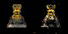
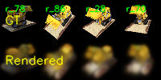
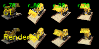
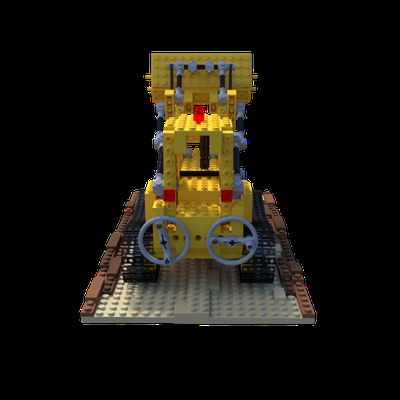

# Assignment 4：Simplified 3D Gaussian Splatting

> 姓名：____冯浩____　学号：_SC24005008_

## 1. 实验目标

本次作业的目标是用纯 PyTorch 实现一个简化版 3D Gaussian Splatting（3DGS）流程。整个过程分为三部分：首先用 COLMAP 从多视角图像中恢复相机参数和稀疏点云；随后将稀疏点扩展为可优化的三维高斯，并完成投影和 alpha blending；最后在同一组数据上运行官方 3DGS，比较两种实现的效果与效率。

实验使用 `lego` 场景。原始数据包含 100 张 $400\times400$ 的环绕视角图像。简化版在读取数据时采用 8 倍下采样，实际训练分辨率为 $50\times50$；官方实现使用原始分辨率。

## 2. 运行环境与使用方法

主要依赖为 Python、PyTorch、CUDA、OpenCV、COLMAP、NumPy 和 natsort。COLMAP 特征提取和匹配使用 CPU，3DGS 参数优化使用 GPU。由于实验输出中没有保存完整的硬件和版本日志，提交前可在这里补充实际使用的 GPU 型号及软件版本。

简化版的主要运行命令如下：

```bash
# 1. 稀疏重建
python mvs_with_colmap.py --data_dir data/lego

# 2. 检查点云与相机参数
python debug_mvs_by_projecting_pts.py --data_dir data/lego

# 3. 训练简化版 3DGS
python train.py \
    --colmap_dir data/lego \
    --checkpoint_dir data/lego/checkpoints \
    --num_epochs 200 \
    --device cuda

# 4. 可选：生成绕场景一周的新视角视频
python render_3dgs_mv.py \
    --colmap_dir data/lego \
    --checkpoint data/lego/checkpoints/checkpoint_000180.pt \
    --num_frames 240 --fps 30
```

## 3. Task 1：使用 COLMAP 进行稀疏重建

### 3.1 重建流程

`mvs_with_colmap.py` 依次调用 COLMAP 的 feature extractor、exhaustive matcher 和 mapper。100 张图片来自同一组合成相机，因此设置 `ImageReader.single_camera=1`，并使用 PINHOLE 相机模型。重建完成后，再将二进制模型转换成文本格式，便于后续 PyTorch 数据加载。

COLMAP 最终注册了全部 100 个视角，恢复出 5809 个三维点。稀疏模型的统计信息如下：

| 项目 | 结果 |
| --- | ---: |
| 注册图像数 | 100 |
| 稀疏三维点数 | 5809 |
| 平均 track length | 5.2434 |
| 每张图像的平均观测数 | 304.59 |
| 相机模型 | PINHOLE |
| 图像大小 | $400\times400$ |
| 焦距 $(f_x,f_y)$ | $(550.7672,\ 550.5392)$ |
| 主点 $(c_x,c_y)$ | $(200,\ 200)$ |

### 3.2 重投影检查

为了检查相机位姿和点云是否一致，我将恢复出的三维点按

$$
\mathbf{x}\sim K(R\mathbf{X}+\mathbf{t})
$$

重新投影到每个输入视角。下图左侧是原图，右侧是在黑色背景上绘制的稀疏点。主体轮廓和颜色分布基本吻合，说明相机内外参、坐标变换以及点云颜色的读取没有明显错误。局部仍然比较稀疏，特别是弱纹理区域，这也解释了为什么不能直接用这些点进行稠密的新视角合成。



## 4. Task 2：简化版 3D Gaussian Splatting

### 4.1 三维高斯参数化

每个 COLMAP 点对应一个可优化的三维高斯。位置和颜色由稀疏点云初始化，旋转用单位四元数表示，尺度采用 log-space 参数，不透明度和颜色则在 logit-space 中优化。这样在前向计算时分别使用 `exp` 和 `sigmoid`，可以自然保证尺度为正、颜色与不透明度位于 $[0,1]$。

初始尺度由局部点云密度决定：计算每个点到近邻点的平均距离，再用全局中位数限制过大或过小的初值。与统一设置尺度相比，这种初始化在稀疏程度不同的区域更稳定。

设归一化四元数对应的旋转矩阵为 $R$，三轴尺度组成对角矩阵 $S$，实现的三维协方差为

$$
\Sigma=RSS^TR^T.
$$

该形式保证了协方差矩阵半正定，同时允许高斯通过旋转和各向异性缩放适应局部形状。

### 4.2 从三维投影到二维

先使用 COLMAP 外参将高斯中心变换到相机坐标系：

$$
\mathbf{p}_c=R_c\mathbf{p}_w+\mathbf{t}_c.
$$

透视投影为 $u=f_xx/z+c_x$、$v=f_yy/z+c_y$。其关于相机坐标的雅可比矩阵为

$$
J=
\begin{bmatrix}
f_x/z & 0 & -f_xx/z^2\\
0 & f_y/z & -f_yy/z^2
\end{bmatrix}.
$$

世界坐标中的协方差先经相机旋转变换，再由雅可比投影到图像平面：

$$
\Sigma_{2D}=J(R_c\Sigma_{3D}R_c^T)J^T.
$$

实现中只保留深度位于 $(1,50)$ 范围内的高斯，并按深度从近到远排序。为了避免小协方差造成矩阵不可逆，在二维协方差对角线上加入 $10^{-4}$，计算行列式时也设置了下界。

### 4.3 二维高斯与 alpha blending

对于像素 $\mathbf{x}$，二维高斯值按下式计算：

$$
G_i(\mathbf{x})=\frac{1}{2\pi\sqrt{|\Sigma_i|}}
\exp\left[-\frac12(\mathbf{x}-\boldsymbol\mu_i)^T
\Sigma_i^{-1}(\mathbf{x}-\boldsymbol\mu_i)\right].
$$

代码针对 $2\times2$ 协方差显式计算逆矩阵，省去了对每个像素调用通用矩阵求逆的开销。每个高斯的 alpha 为 $\alpha_i=o_iG_i$，其可见性权重为

$$
w_i=\alpha_i\prod_{j<i}(1-\alpha_j),
$$

最终像素颜色为 $C(\mathbf{x})=\sum_iw_i\mathbf{c}_i$。透射率用 `torch.cumprod` 一次性计算，整个过程保持可微。

### 4.4 训练设置与结果

训练使用逐像素 L1 损失。不同参数的数值尺度和收敛速度差异较大，因此分别设置学习率，而不是对所有参数使用同一个值。

| 设置 | 数值 |
| --- | ---: |
| 训练轮数 | 200 epochs |
| batch size | 1 |
| 训练分辨率 | $50\times50$ |
| 损失函数 | mean L1 loss |
| position learning rate | 0.000016 |
| color learning rate | 0.025 |
| opacity learning rate | 0.05 |
| scale learning rate | 0.005 |
| rotation learning rate | 0.001 |
| gradient clipping | 1.0 |
| checkpoint 间隔 | 20 epochs |

下图给出了固定四个视角在训练开始和第 199 轮时的结果。初始渲染只能形成模糊的颜色团块；训练后，物体的主体轮廓、底座和主要颜色区域已经能够恢复，多视角之间也保持了基本一致。细杆、孔洞和边缘等高频结构仍然明显模糊，并伴有少量漂浮点。

| Epoch 0 | Epoch 199 |
| --- | --- |
|  |  |

出现上述局限的主要原因不是单纯的训练轮数不足，而是表示能力受限：本实现始终只有 5809 个高斯，没有 adaptive densification 和 pruning；颜色是固定 RGB，而不是随观察方向变化的球谐系数；同时，纯 PyTorch 渲染需要构造完整的“高斯数 × 图像高 × 图像宽”张量，因此只能在较低分辨率下训练。

训练过程中保存了 10 个 checkpoint、200 张逐轮对比图以及一个沿训练相机轨迹生成的调试视频：[查看简化版渲染视频](report_assets/simplified_debug_rendering.mp4)。

## 5. Task 3：与官方 3DGS 的比较

### 5.1 官方实现设置与评测

官方实现使用相同的 `lego` 数据，开启 `eval` 划分，球谐阶数为 3，背景设为黑色，训练 7000 iterations。最终训练集和测试集分别包含 87、13 个视角。经过 densification 后，保存的点云包含 250205 个高斯，远多于简化版的 5809 个。

评测时逐一核对了 GT 与 render 的文件名，并统一按 RGB 图像计算。这个检查很重要：原始 PNG 含 alpha 通道，前几次直接比较时由于通道和背景处理不一致，得到的 PSNR 只有约 5～7 dB，数值与肉眼观察明显矛盾。修正评测输入后，最终结果如下：

| 数据划分 | 视角数 | PSNR | SSIM |
| --- | ---: | ---: | ---: |
| Train | 87 | 25.90 dB | 0.9487 |
| Test | 13 | 25.77 dB | 0.9412 |

下图展示一个测试视角。官方版本可以清楚恢复轮子、积木边缘、栏杆和底板纹理；与 GT 相比仍有轻微的平滑和边缘误差，但整体结构已经比较完整。

| Ground Truth | Official 3DGS（7000 iterations） |
| --- | --- |
|  |  |

### 5.2 综合比较

| 对比项 | 简化版 PyTorch 实现 | 官方 3DGS |
| --- | --- | --- |
| 高斯数量 | 5809，训练中固定 | 250205，可自适应增密和裁剪 |
| 训练分辨率 | $50\times50$ | $400\times400$ |
| 颜色表示 | 每个高斯一个 RGB | 3 阶球谐，可描述视角相关颜色 |
| 渲染方式 | 全图张量、统一深度排序 | CUDA tile-based rasterizer |
| 视觉质量 | 主体可辨认，细节模糊，有漂浮点 | 结构和纹理清晰，测试集 PSNR 25.77 dB |
| 输出模型大小 | checkpoint 约 0.94 MiB | PLY 约 59.18 MiB |
| 粗略耗时 | 200 epochs 及调试输出约 11.1 min | 训练产物约 1.3 min，连同 train/test 渲染约 3.8 min |

耗时来自现有输出文件的时间戳，只能作为本次运行的粗略记录，不能替代在同一硬件上用计时器进行的严格 benchmark。尤其是两者的“epoch”和“iteration”定义不同，分辨率也不同，因此不应只比较迭代次数。即使官方实现使用了更多高斯和更高分辨率，它仍然更快，说明 tile-based CUDA rasterizer 对计算量的裁剪非常关键。

本次没有保存 `nvidia-smi` 的峰值记录，因此不报告虚构的显存数字。可以从计算结构分析两者的区别：简化版仅 `gaussian_values` 一个张量就包含

$$
5809\times50\times50=14{,}522{,}500
$$

个浮点数，float32 下约为 55.4 MiB；训练时还需要 alpha、透射率、中间结果和反向传播缓存。其显存复杂度近似为 $O(NHW)$，分辨率稍微提高就会迅速增长。官方实现虽然维护更多高斯参数，但只在高斯覆盖到的 tile 内计算并提前终止低透射率像素，避免建立完整的 $N\times H\times W$ 张量，因此扩展性明显更好。模型文件大小反映的是参数数量，不等同于峰值显存，这两项需要区分。

## 6. 总结

本次实验完成了从 COLMAP 稀疏重建、三维高斯参数化、透视协方差投影到可微 alpha blending 的完整流程。简化版已经能从多视角监督中恢复 `lego` 的主要形状，也直观展示了 3DGS 的核心机制；但固定数量高斯、低分辨率训练、RGB 颜色和全图渲染共同限制了细节与效率。官方实现的结果表明，3DGS 的实际性能不仅来自高斯这一表示形式，也依赖自适应增密、球谐颜色以及面向 GPU 的 tile rasterization。对我而言，本次作业最有价值的部分是把论文中的投影公式真正落实到张量计算，并通过重投影和 RGB/alpha 检查定位了几次“数值看似异常、实际是数据处理不一致”的问题。

